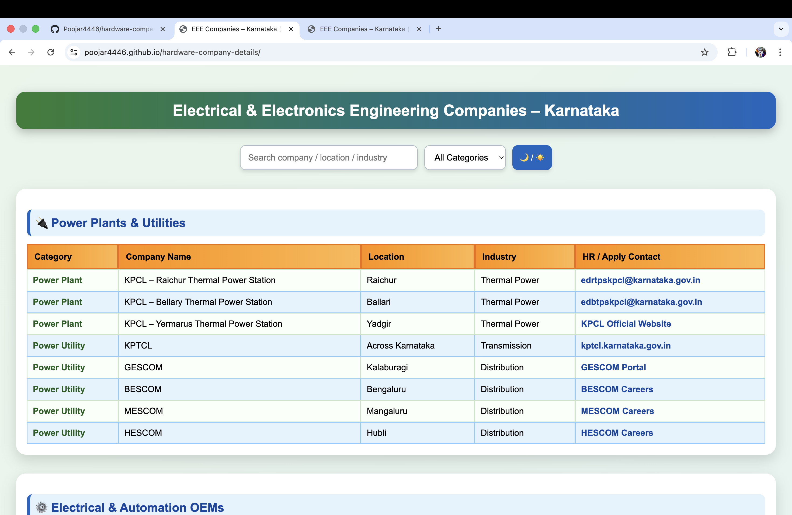
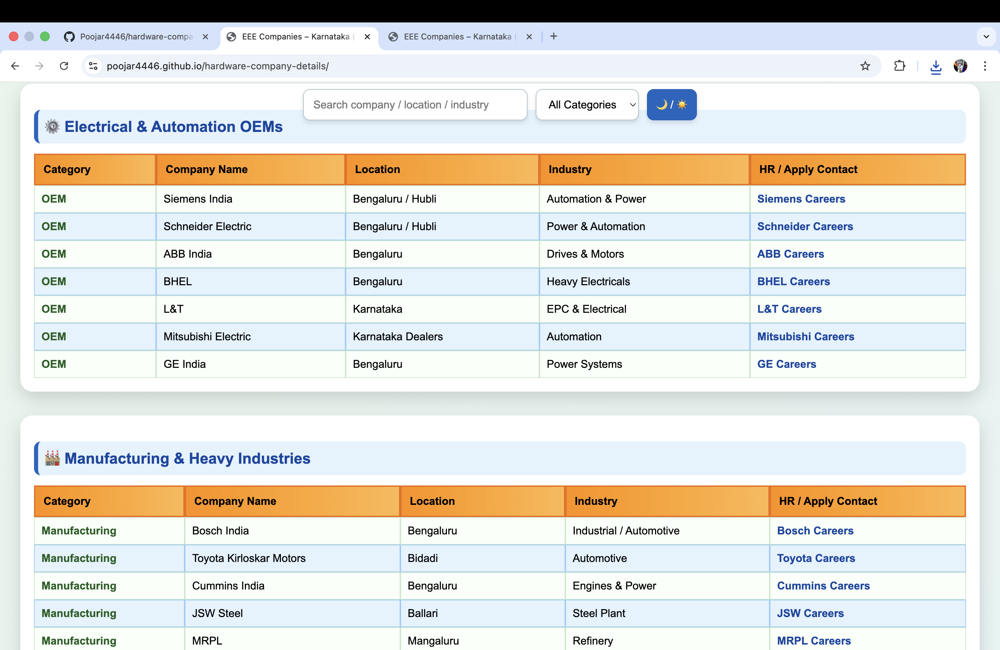
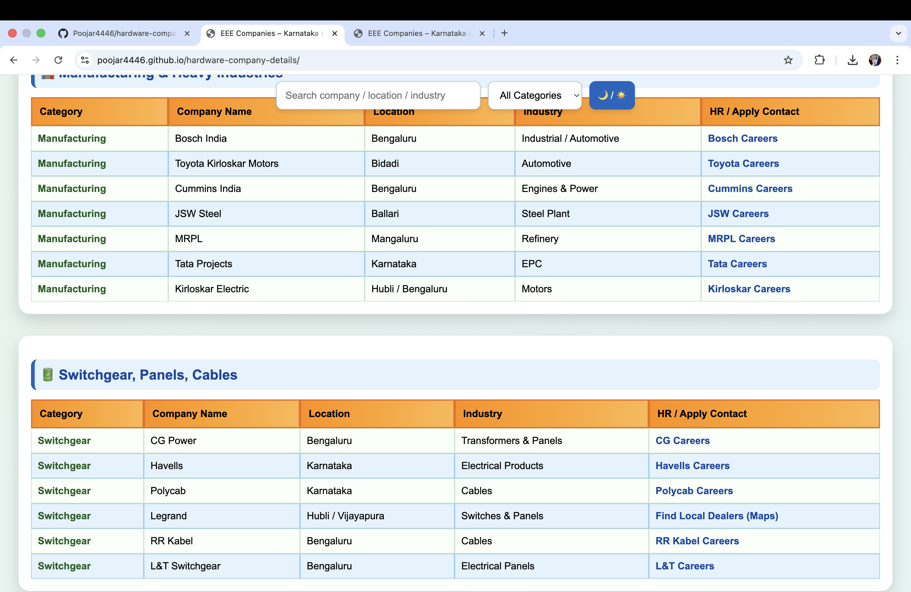
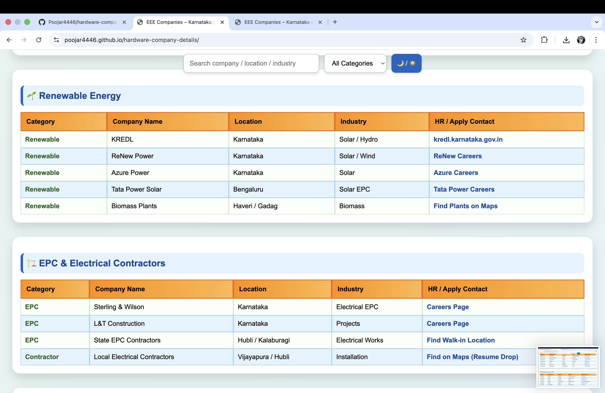
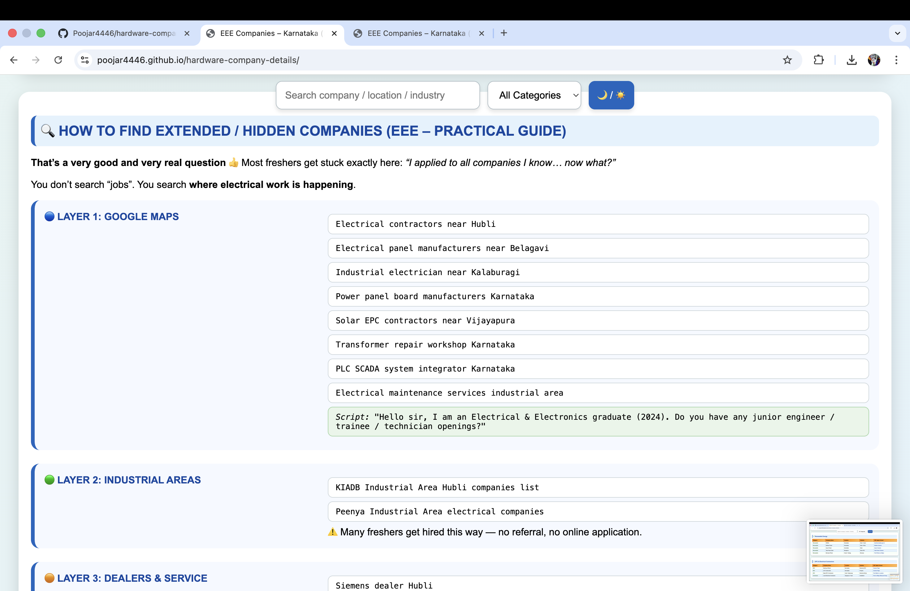
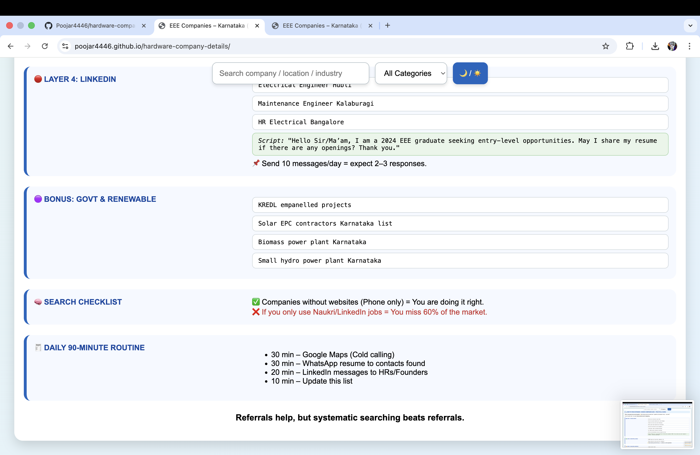

Electrical & Electronics Engineering Companies – Karnataka ⚡
A simple and responsive web project to help EEE students and freshers find
core electrical companies and hidden job opportunities across Karnataka.

What this project does 🧠
• Lists EEE companies category-wise  
• Helps discover hidden companies using Google Maps & LinkedIn  
• Works smoothly on mobile, tablet, and desktop  

Main Features 🚀
• industry-wise company tables  
• Search by company name, location, or industry  
• Category filter  
• Light & Dark mode  
• Fully responsive design  

Technologies Used 🛠️
• HTML  
• CSS  
• JavaScript  

### Screenshots 📸

Who should use this? 🎯
• EEE freshers  
• Core electrical job seekers  
• Students building real-world projects  

Project Purpose 💡
Most core electrical jobs are not posted on job portals.
This project focuses on systematic searching to find companies
where real electrical work is happening.

Referrals help, but systematic searching works better.
